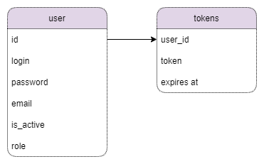
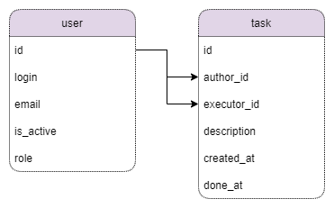

# Урок 0

## Общая схема сервисов

## Взаимодействие между сервисами
Предполагается асинхронное взаимодействие между сервисами.  
Обмен данными будет происходить через очередь сообщений.  
Сообщения будут содержать всю необходимую информацию для использования в сервисах, поэтому не придется выполнять доп запросы напрямую к сервисам.

### Сервис авторизации

### Сервис задач

### Сервис расчетов

### Сервис аналитики

## Структура данных сервисов

### Сервис авторизации

### Сервис задач

### Сервис расчетов

### Сервис аналитики

