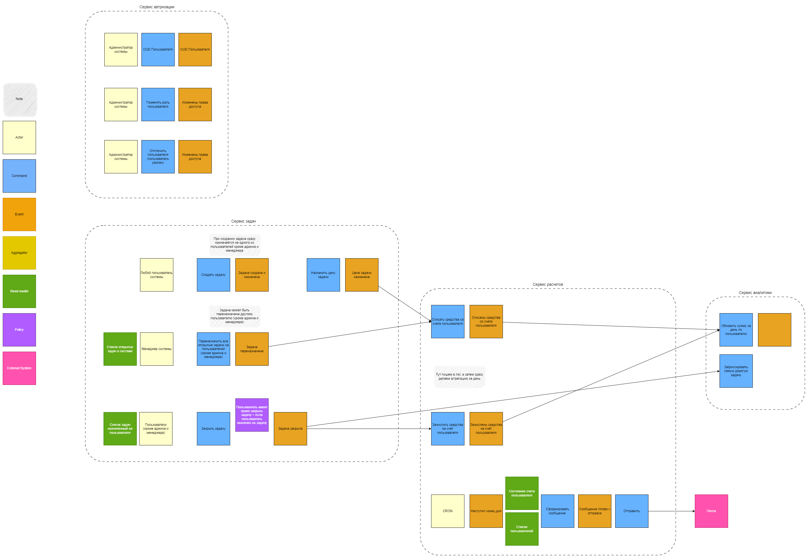
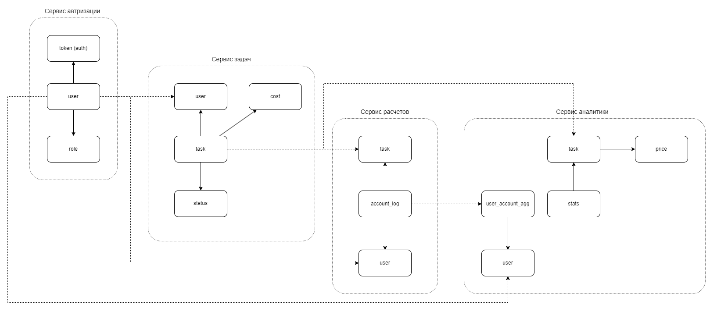

# Неделя 1. Проектирование

## Акторы, Команды, События системы, Домены... EventStorming

## Данные, распределение по доменам

## Бизнес-события

- Событие "Права доступа изменены" `user.permissions.changed`
- Событие "Задача переназначена" `task.reassigned`
- Событие "Задача закрыта" `task.done`
- Событие "Списаны средства со счета пользователя" `account.minus`
- Событие "Зачислены средства на счет пользователя" `account.plus`

## События CUD
### Сервис авторизации
#### Событие "Пользователь создан/обновлен" `user.created`, `user.updated`
Атрибуты:
- id
- role
- name

Получатели:
- Сервис задач
- Сервис расчетов
- Сервис аналитики

### Сервис задач
#### Событие "Задача создана" `task.created`
Атрибуты:
- id
- description
- user_id

Получатели:
- Сервис расчетов
- Сервис аналитики

#### Событие "Задача обновлена" `task.updated`
Атрибуты:
- id
- description
- user_id

Получатели:
- Сервис расчетов
- Сервис аналитики

### Сервис CRON
#### Событие "Наступил конец дня" `crontime.endofday`
Атрибуты:
- name

Получатели:
- Сервис расчетов
